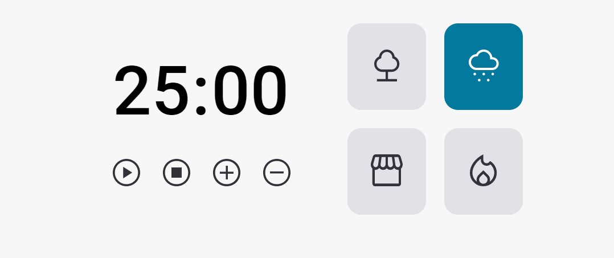

# Focus Timer

Criação de cronômetro baseado no pomodoro, utlizando a linguagem javascript.

## Tecnologias utilizas:

- HTML5
- CSS3
- JAVSCRIPT

## Funcionalidades:

- Adicionar mais tempo (5 minutos)
- Dimiuir o tempo (5 minutos);
- Play e Pause;
- Escolher entre quatro sons, para tocar de fundo;