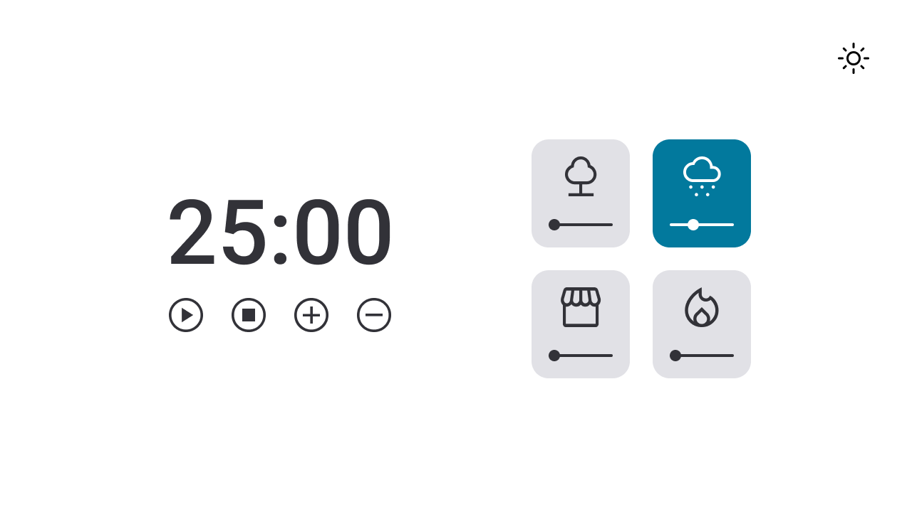

# Focus Timer

Practicing what I have learned about javascript, I created the focus timer.

## 🚀 Technologies :

**Front-end:** HTML5, CSS3 and JAVASCRIPT;

## 👩‍💻 Functionalities:

- Add more time (5 minutes);
- Decrease the time (5 minutes);
- Play and Pause;
- Choose from four sounds to play in the background;
- Increase and decrease the sound volume;
- Light or dark background option (dark mode);

## 💻 How to use :

Project Link : https://project-focus-timer.vercel.app/

## 👨 Author :

[@jhonathanSousa](https://www.linkedin.com/in/jhonathan-alves-sousa/)

