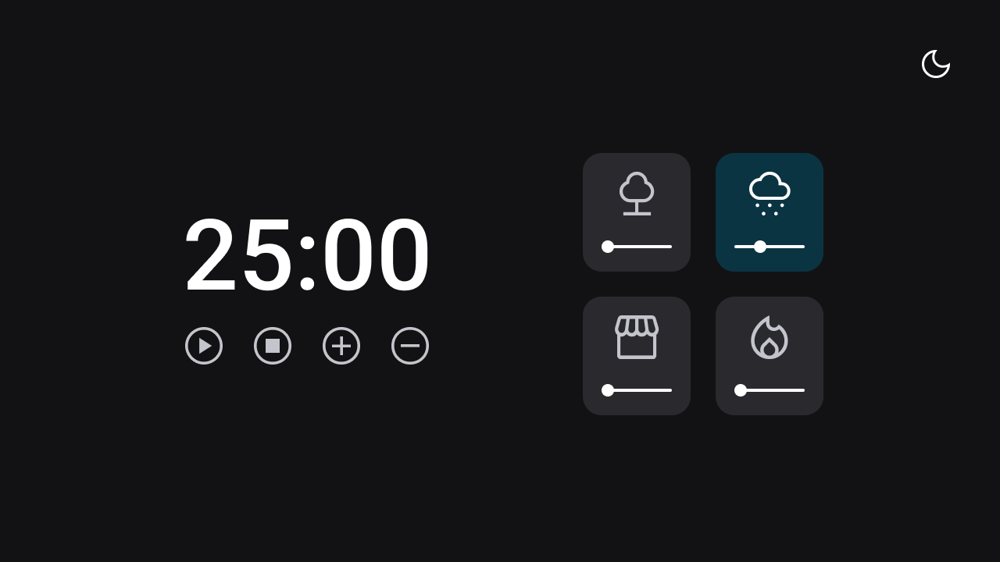

# Focus Timer

Criação de cronômetro baseado no pomodoro, utlizando a linguagem JavaScript.

## Tecnologias utilizas:

- HTML5;
- CSS3;
- JAVASCRIPT;

## Funcionalidades:

- Adicionar mais tempo (5 minutos)
- Dimiuir o tempo (5 minutos);
- Play e Pause;
- Escolher entre quatro sons, para tocar de fundo;
- Aumentar e abaixar o volume do som;
- Opção de fundo claro ou escuro (dark-mode);